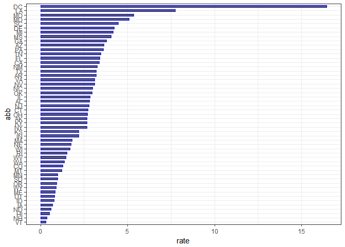

Report on US gun murders 2010
================
Kaycee
19 June 2018

Introduction
------------

This is a report on 2010 gun murders obtained by FBI reports. The raw data was obtained from \[this wikipedia page\] (<https://en.wikipedia.org/wiki/Murder_in_the-United-States-by-state>).

We are going to use the following library:

``` r
library(tidyverse)
```

and load the data we arleady wrangled:

``` r
load("rda/murders.rda")
```

Murder rate by state
--------------------

We note the large state to state variability by generating a barplot showing the murder rates by state:


